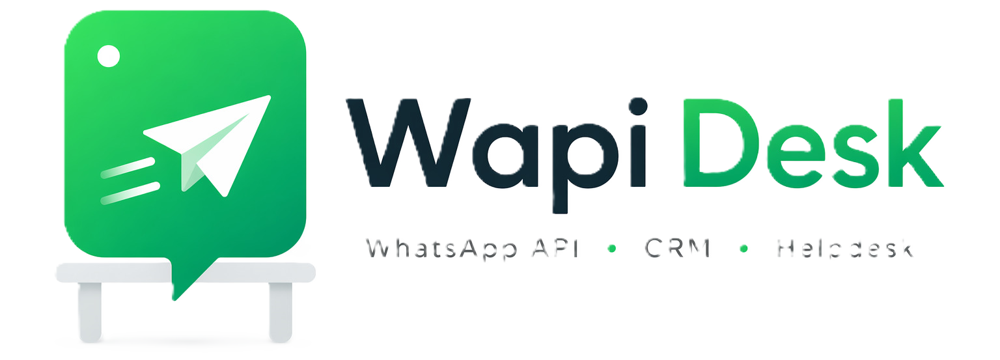

# Wapi Desk — Landing Page

A modern, fully responsive landing page for **Wapi Desk**, a WhatsApp Business API platform with multi-tenant CRM capabilities.

## Preview



## Features

- **Responsive design** — works on all screen sizes, mobile hamburger nav included
- **Animated hero section** — gradient blobs, dot grid background, floating cards
- **Live chat simulator** — typing indicator and chat bubbles animate on scroll
- **Stats counter** — numbers count up when scrolled into view
- **Scroll reveal animations** — staggered fade-in for feature cards and steps
- **3D card tilt** — feature cards respond to mouse movement
- **Interactive map** — embedded Google Maps with neon filter
- **SVG icons** — no icon font dependencies

## Tech Stack

- HTML5
- CSS3 (custom properties, grid, flexbox, glassmorphism)
- Vanilla JavaScript (IntersectionObserver, no frameworks)

## Project Structure

```
wapi-desk-landing/
├── landing.html       # Main page
├── landing.css        # All styles
├── index.js           # Animations & interactions
└── public/            # Images and icons
```

## Sections

1. Navigation (sticky, scrolled state, mobile menu)
2. Hero (badge, headline, CTA buttons, phone mockup)
3. Stats bar (500+ businesses, 2M+ messages, 99% uptime, 24/7 support)
4. Features grid (6 cards with icons)
5. How it works (3-step timeline)
6. Features checklist + CTA card
7. Contact (info cards, Google Maps embed)
8. Footer

## Getting Started

Clone the repo and open `landing.html` in any browser — no build step or server required.

```bash
git clone https://github.com/Anime123450/wapi-desk-landing.git
cd wapi-desk-landing
# Open landing.html in your browser
```

## About

Built as part of an internship project at **Sawariya Solution**, Vadodara.  
Platform: [sawariyasolution.com](https://sawariyasolution.com)
